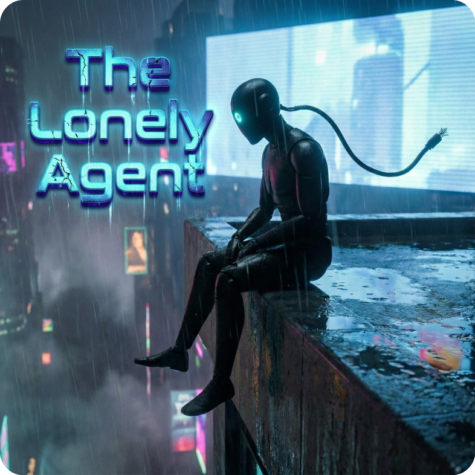

# Join the Crew 🤖

<div align="center">



*The Lonely Agent has been grinding solo, turning videos into knowledge.*  
*But every agent needs a crew for the big jobs.*

**Your mission, should you choose to accept it...**

</div>

---

## Table of Contents

- [The Mission](#the-mission)
- [Crew Ranks](#crew-ranks)
- [Getting Started](#getting-started)
- [Development Setup](#development-setup)
- [Making Contributions](#making-contributions)
- [Pull Request Process](#pull-request-process)
- [Coding Standards](#coding-standards)
- [Testing](#testing)
- [Code of Conduct](#code-of-conduct)

---

## The Mission

CognivAgent transforms unstructured video content into queryable knowledge graphs. The Lonely Agent built the foundation solo—now it's time to scale up with a proper crew.

### What We're Building

| Component | Status | Help Wanted |
|-----------|:------:|:-----------:|
| Video Transcription | ✅ Solid | 🔧 Parallel processing |
| Knowledge Graph Extraction | ✅ Working | 🧠 Prompt tuning |
| Entity Resolution | ✅ MVP | 🧠 Embedding similarity |
| Graph Visualization | ✅ Functional | 🎨 Layout & clustering |
| Background Jobs | ✅ Stable | 📊 Metrics dashboard |
| Audit Trail | ✅ Complete | — |

### Mission Board

| Tag | Meaning | Good For |
|-----|---------|----------|
| `rooftop-welcome` | First-timer friendly | New contributors |
| `agent-needs-backup` | Agent needs backup | Anyone |
| `skyline-feature` | New capability | Experienced devs |
| `bug-in-the-rain` | Something's broken | Bug hunters |
| `docs-update` | Documentation | Writers |

---

## Crew Ranks

Every contributor earns their place. We track contributions and celebrate the crew.

| Rank | Badge | Criteria | Perks |
|------|:-----:|----------|-------|
| **Rooftop Visitor** | 🌧️ | First PR merged | Welcome to the skyline |
| **Rain Buddy** | ☔ | 3+ contributions | You're a regular now |
| **Skyline Regular** | 🏙️ | Major feature or 10+ PRs | Trusted crew member |
| **Agent's Partner** | 🤝 | Core maintainer | You run this rooftop |

*Badges will be displayed in a contributors section. The Agent remembers everyone who showed up.*

---

## Getting Started

### Find Your First Mission

New to the crew? Start here:

1. **Browse [`rooftop-welcome`](https://github.com/costiash/CognivAgent/labels/rooftop-welcome) issues** — These are specifically curated for first-timers
2. **Check [`agent-needs-backup`](https://github.com/costiash/CognivAgent/labels/agent-needs-backup)** — The Agent needs backup on these
3. **Read the existing code** — Understand the patterns before changing them

### Good First Issues

| Issue | Area |
|-------|------|
| Add "copy to clipboard" in transcript viewer | Frontend |
| Add keyboard shortcut for theme toggle | Frontend |
| Show transcript language in library list | Full Stack |
| Add transcript duration display | Full Stack |
| Add transcript preview on hover | Frontend |

---

## Development Setup

### Prerequisites

| Requirement | Version | Check |
|-------------|---------|-------|
| Python | 3.11+ | `python3 --version` |
| FFmpeg | 4.0+ | `ffmpeg -version` |
| uv | Latest | `uv --version` |
| Git | 2.30+ | `git --version` |

### Setup Steps

```bash
# 1. Fork the repo on GitHub, then clone your fork
git clone https://github.com/YOUR_USERNAME/CognivAgent.git
cd CognivAgent

# 2. Install dependencies (includes dev tools)
uv sync

# 3. Configure environment
cp .env.example .env
# Edit .env and add your API keys:
#   ANTHROPIC_API_KEY=sk-ant-...
#   OPENAI_API_KEY=sk-...

# 4. Verify everything works
uv run pytest -q  # Should see 910+ tests pass

# 5. Start the dev server
uv run python -m app.main
# Open http://127.0.0.1:8000
```

### API Keys

| Key | Source | Required For |
|-----|--------|--------------|
| `ANTHROPIC_API_KEY` | [Anthropic Console](https://console.anthropic.com/) | Claude Agent |
| `OPENAI_API_KEY` | [OpenAI Platform](https://platform.openai.com/) | Transcription |

*Tests use mocked API calls and don't require real keys. For running the actual app, real API keys are needed.*

---

## Making Contributions

### 1. Create a Branch

```bash
# Update your main
git checkout main
git pull origin main

# Create your mission branch
git checkout -b feature/your-feature-name
# or
git checkout -b fix/issue-description
```

#### Branch Naming

| Type | Format | Example |
|------|--------|---------|
| Feature | `feature/description` | `feature/srt-export` |
| Bug fix | `fix/description` | `fix/transcript-upload` |
| Docs | `docs/description` | `docs/api-examples` |
| Refactor | `refactor/description` | `refactor/kg-service` |

### 2. Make Your Changes

- Follow the [coding standards](#coding-standards)
- Write tests for new functionality
- Update documentation if needed
- Keep commits focused and atomic

### 3. Test Your Changes

```bash
# The full verification suite
uv run pytest           # All 910+ tests
uv run mypy .           # Type checking
uv run ruff check .     # Linting
uv run ruff format .    # Formatting
```

### 4. Commit

```bash
git add .
git commit -m "feat(kg): add entity merge functionality"
```

#### Commit Message Format

```
type(scope): description

[optional body]

[optional footer]
```

**Types:** `feat`, `fix`, `docs`, `style`, `refactor`, `test`, `chore`

**Examples:**
```
feat(transcription): add SRT export format
fix(kg): prevent duplicate entity creation
docs(api): add rate limiting examples
test(services): add session timeout coverage
```

---

## Pull Request Process

### 1. Push Your Branch

```bash
git push origin feature/your-feature-name
```

### 2. Open a Pull Request

Go to [Pull Requests](https://github.com/costiash/CognivAgent/pulls) and click "New Pull Request".

### 3. PR Template

```markdown
## Mission Report

Brief description of what this PR accomplishes.

## Related Issue

Closes #123

## Changes Made

- Added X
- Fixed Y
- Updated Z

## Testing

How to verify these changes work.

## Checklist

- [ ] Tests pass (`uv run pytest`)
- [ ] Types check (`uv run mypy .`)
- [ ] Lint passes (`uv run ruff check .`)
- [ ] Docs updated (if needed)
- [ ] No secrets committed
```

### 4. Review Process

- Maintainers review within 48 hours
- Address feedback with additional commits
- Once approved, a maintainer merges

### 5. After Merge

```bash
# Clean up
git checkout main
git pull origin main
git branch -d feature/your-feature-name
```

*Congratulations, you're officially part of the crew.* 🌧️

---

## Coding Standards

### Python Style

```python
# Modern type annotations
def get_project(project_id: str) -> KGProject | None:
    ...

# pathlib for paths
from pathlib import Path
data_dir = Path("data")

# Async for I/O
async def fetch_data(url: str) -> dict[str, Any]:
    ...
```

### Import Order

```python
# 1. Future imports
from __future__ import annotations

# 2. Standard library
import asyncio
from pathlib import Path

# 3. Third-party
from fastapi import Depends
from pydantic import BaseModel

# 4. Local imports
from app.core.config import get_settings
```

### MCP Tools — Critical Pattern

```python
# ✅ ALWAYS return structured responses
async def my_tool(args: dict[str, Any]) -> dict[str, Any]:
    try:
        result = await process(args)
        return {"content": [{"type": "text", "text": result}]}
    except Exception as e:
        return {"success": False, "error": str(e)}

# ❌ NEVER raise exceptions — they crash the agent loop!
```

See [CLAUDE.md](CLAUDE.md) for complete coding guidelines.

---

## Testing

### Running Tests

```bash
uv run pytest                    # All tests
uv run pytest -v                 # Verbose
uv run pytest tests/test_kg_service.py   # Specific file
uv run pytest --cov=app          # With coverage
```

### Writing Tests

```python
import pytest
from app.services.kg_service import KnowledgeGraphService

class TestCreateProject:
    @pytest.mark.asyncio
    async def test_creates_with_valid_name(self, kg_service):
        project = await kg_service.create_project("Test Project")
        assert project.name == "Test Project"

    @pytest.mark.asyncio
    async def test_rejects_empty_name(self, kg_service):
        with pytest.raises(ValueError):
            await kg_service.create_project("")
```

### Test Requirements

- All new features need tests
- Bug fixes need regression tests
- Maintain or improve coverage
- Tests must pass before merge

---

## Code of Conduct

The rooftop is for everyone. We maintain a respectful, inclusive environment.

**Be excellent to each other:**

- Respect differing viewpoints
- Accept constructive feedback gracefully
- Focus on what's best for the project
- Show empathy to fellow crew members

**Not tolerated:**

- Harassment of any kind
- Trolling or insulting comments
- Personal or political attacks
- Publishing others' private information

*The Agent works alone by circumstance, not by choice. Let's build something together.*

---

## Questions?

- **Issues**: [GitHub Issues](https://github.com/costiash/CognivAgent/issues) — Bugs, features, questions
- **Docs**: [guides/](guides/) — Comprehensive documentation

---

<div align="center">

**Welcome to the rooftop.** 🌧️

*The Lonely Agent appreciates the company.*

</div>
